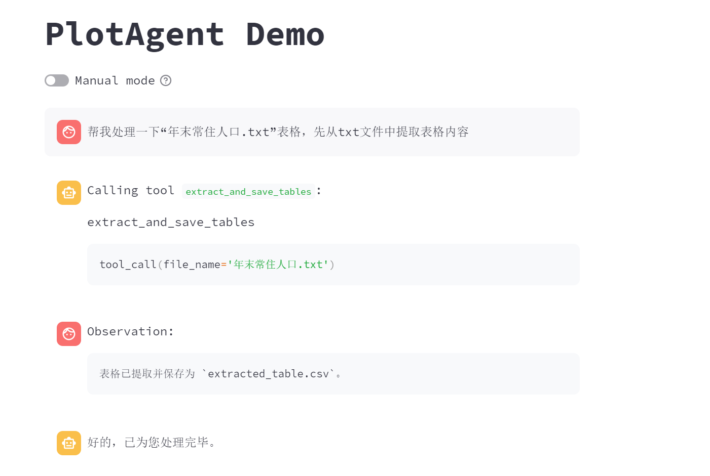

# TableAgent

> 2024-09-05

## 1. 任务简介

### 1.1 任务目标

使用大语言模型（LLM）进行数据分析和可视化，通过自然语言与 LLM 交互生成 Python 代码，分析和可视化文本中的数据。

### 1.2 任务概述

1. 数据处理：设计合适的 prompt，指示 LLM 生成输出，读取文本文件，去除表头表尾，另存为一个新CSV 文件。
2. 数据分析：读取预处理后的 CSV 文件，设计合适的 prompt，指示 LLM 生成 Python 代码，对单个 CSV 文件进行增删改查以及数据可视化。
   1. 计算近 10 年各地区的人口均值、最大值和最小值，按列添加到表的最后。
   2. 以饼状图的形式，可视化近 10 年各地区的平均人口比例。
   3. 以折线图的形式，可视化近 10 年浙江省的人口变化趋势。
3. 仅使用本地大语言模型。


## 2. 具体实现

### 2.1 模型选取

项目选用了 **ChatGLM3** 模型，这是一款由清华大学和智谱AI联合开发的开源大规模语言模型，专注于中文自然语言处理任务，具备高效的推理性能和生成能力。同时该模型支持本地化部署，可以在无网络的环境中完成所有分析与可视化任务。

### 2.2 处理过程

有四个主要文件：

- **`main.py`**: 用于启动 `Streamlit` 应用，初始化页面配置，并处理与用户的交互。它是整个应用的入口，负责渲染页面布局、侧边栏、工具调用输入框等用户界面组件，并与其他模块协作完成工具调用和数据处理。

- **`demo_tool.py`**: 负责处理与工具调用相关的逻辑，通过与用户的输入进行互动，调用注册的工具，并实时展示工具的执行结果。

- **`client.py`**: 负责加载模型，通过流式生成的方式逐步返回对话生成结果。
- **`tool_registry.py`**: 负责管理和注册项目中的工具，并提供接口来调用这些工具。通过该文件，所有工具可以被动态注册和调度，提供了 `dispatch_tool` 方法，用于根据工具名和参数调用具体工具，并返回执行结果。

此外，使用了 `tool_chain`，其原理是将多个步骤的指令串联在一起，通过每一步生成的代码和数据输出作为下一个步骤的输入。这个工具链能够高效地将自然语言指令转化为具体的 Python 代码，实现自动化的数据处理与分析任务。每个步骤都会在执行过程中验证输出结果的正确性，确保生成的代码符合预期，并可以根据需要调整 Prompt 以优化生成的代码。

`TOOL_PROMPT`在`conversation.py`中定义如下：


与如下的工具描述进行连接，提示agent其任务以及可以调用的工具列表及其属性。相当于整体上的`system_prompt`如下：


### 2.3 tool_functions定义

在**`tool_registry.py`**文件中，可参考**附录A**，有详细的代码实现

### 2.4 用户交互

用户交互界面通过`streamlit`进行搭建，其初始界面如下：


设置了**表格数据展示、饼状图展示、折线图展示**三个组件，上图为尚未生成时的状态，下图为生成后的状态：

|  |  |  |
| ------------------------------------------------------------ | ------------------------------------------------------------ | ------------------------------------------------------------ |


## 3. 部署指南

克隆本项目github代码：

```powershell
git clone https://github.com/DjangoJungle/PlotAgent
cd PlotAgent
```

创建虚拟环境（需安装anaconda）：

```text
conda create -n chatglm python=3.11
conda activate chatglm
```

安装依赖：

```text
pip install -r requirements.txt
```

下载模型：

```
git clone https://www.modelscope.cn/ZhipuAI/chatglm3-6b.git
```

根据模型下载的路径更改`client.py`中的`MODEL_PATH`参数

运行模型：

```
cd PlotAgent/composite_demo
streamlit run main.py
```

> 整个过程的环境配置较为复杂，在最后的**附录B**附上一个可运行的anaconda环境供参考
>
> 且如果配置不够且需要较流畅运行，需要对部分代码加上量化操作


## 4. 执行效果

* 表头表尾去除：

  |  |  |
  | ------------------------------------------------------------ | ------------------------------------------------------------ |

* 平均值计算并添加

  |  |  |
  | ------------------------------------------------------------ | ------------------------------------------------------------ |

* 最大、最小值添加

  |  |  |
  | ------------------------------------------------------------ | ------------------------------------------------------------ |

* 删除行、列

  |  |  |  |
  | ------------------------------------------------------------ | ------------------------------------------------------------ | ------------------------------------------------------------ |

* 增加行、列

  |  |  |
  | ------------------------------------------------------------ | ------------------------------------------------------------ |

* 查询数据

  |  |
  | ------------------------------------------------------------ |

* 更新数据

  |  |  |
  | ------------------------------------------------------------ | ------------------------------------------------------------ |

* 画饼状图

  |  |  |
  | ------------------------------------------------------------ | ------------------------------------------------------------ |

* 画折线图

  |  |  |
  | --------------------------------------- | ------------------------------------------------------------ |
  
  
  
  ## 附A：tool_functions定义
  
  ```python
  @register_tool
  def extract_and_save_tables(file_name: Annotated[str, 'The name of the text file containing tables', True]) -> str:
      """
      从文本文件中提取逗号分隔的表格并保存为CSV文件，随后可视化表格内容。
      """
      def is_comma_separated_line(line):
          return line.count(',') >= 2
  
      def save_table(table_lines):
          output_file = "extracted_table.csv"
          with open(output_file, 'w', encoding='utf-8') as file:
              for line in table_lines:
                  file.write(line)
          return output_file
  
      file_path = f"./{file_name}"
      try:
          with open(file_path, 'r', encoding='utf-8') as file:
              lines = file.readlines()
  
          table_lines = []
          in_table = False
          column_count = 0
  
          for line in lines:
              if is_comma_separated_line(line):
                  current_column_count = line.count(',') + 1
                  if not in_table:
                      in_table = True
                      column_count = current_column_count
                      table_lines.append(line)
                  else:
                      if current_column_count == column_count:
                          table_lines.append(line)
                      else:
                          break
              else:
                  if in_table:
                      break
  
          if table_lines:
              output_file = save_table(table_lines)
              df = pd.read_csv(output_file, index_col=0)
              st.table(df)  # 可视化表格
              return f"表格已提取并保存为 `{output_file}`。"
          else:
              return "文件中未找到有效表格。"
  
      except Exception as e:
          return f"处理文件时发生错误: {e}"
  
  
  @register_tool
  def append_average(file_name: Annotated[str, 'The name of the csv file containing data', True]) -> str:
      """
      向表格中添加 '平均值' 列，计算每行的平均值并可视化表格。
  
      参数:
      - file_name: CSV 文件的名称，包含要处理的数据。
  
      作用:
      - 计算每一行的数值列的平均值，并添加到 '平均值' 列。如果该列已存在，则会先删除旧的列，再添加新的 '平均值' 列。
      """
      file_path = f"./{file_name}"
      df = pd.read_csv(file_path, index_col=0)
  
      if '平均值' in df.columns:
          df.drop('平均值', axis=1, inplace=True)
  
      df['平均值'] = df.mean(axis=1)
      df.to_csv(file_path, header=True)
  
      st.table(df)  # 可视化表格
      return "平均值列已成功添加并保存。"
  
  
  @register_tool
  def append_max(file_name: Annotated[str, 'The name of the csv file containing data', True]) -> str:
      """
      向表格中添加 '最大值' 列，计算每行的最大值并可视化表格。
  
      参数:
      - file_name: CSV 文件的名称，包含要处理的数据。
  
      作用:
      - 计算每一行的数值列的最大值，并添加到 '最大值' 列。
      """
      file_path = f"./{file_name}"
      df = pd.read_csv(file_path, index_col=0)
      df['最大值'] = df.max(axis=1)
      df.to_csv(file_path, header=True)
  
      st.table(df)  # 可视化表格
      return "最大值列已成功添加并保存。"
  
  
  @register_tool
  def append_min(file_name: Annotated[str, 'The name of the csv file containing data', True]) -> str:
      """
      向表格中添加 '最小值' 列，计算每行的最小值并可视化表格。
  
      参数:
      - file_name: CSV 文件的名称，包含要处理的数据。
  
      作用:
      - 计算每一行的数值列的最小值，并添加到 '最小值' 列。
      """
      file_path = f"./{file_name}"
      df = pd.read_csv(file_path, index_col=0)
      df['最小值'] = df.min(axis=1)
      df.to_csv(file_path, header=True)
  
      st.table(df)  # 可视化表格
      return "最小值列已成功添加并保存。"
  
  
  @register_tool
  def delete_row(file_name: Annotated[str, 'The name of the csv file containing data', True],
                 row_name: Annotated[str, 'The name of the row being deleted', True]) -> str:
      """
      删除指定名称的行并可视化表格。
  
      参数:
      - file_name: CSV 文件的名称，包含要处理的数据。
      - row_name: 要删除的行的名称（行索引）。
  
      作用:
      - 从表格中删除指定名称的行，并更新表格。
      """
      file_path = f"./{file_name}"
      df = pd.read_csv(file_path, index_col=0)
      if row_name not in df.index:
          return "无效的删除要求，未找到指定行。"
  
      df.drop(row_name, inplace=True)
      df.to_csv(file_path)
  
      st.table(df)  # 可视化表格
      return f"行 '{row_name}' 的数据已成功删除。"
  
  
  @register_tool
  def delete_column(file_name: Annotated[str, 'The name of the csv file containing data', True],
                    column_name: Annotated[str, 'The name of the column being deleted', True]) -> str:
      """
      删除指定名称的列并可视化表格。
  
      参数:
      - file_name: CSV 文件的名称，包含要处理的数据。
      - column_name: 要删除的列的名称（列标题）。
  
      作用:
      - 从表格中删除指定名称的列，并更新表格。
      """
      file_path = f"./{file_name}"
      df = pd.read_csv(file_path, index_col=0)
  
      if column_name not in df.columns:
          return "无效的删除要求，未找到指定列。"
  
      df.drop(column_name, axis=1, inplace=True)
      df['平均值'] = df.mean(axis=1)
      df['最大值'] = df.max(axis=1)
      df['最小值'] = df.min(axis=1)
      df.to_csv(file_path)
  
      st.table(df)  # 可视化表格
      return f"列 '{column_name}' 的数据已成功删除，并重新计算统计列。"
  
  
  @register_tool
  def append_row(file_name: Annotated[str, 'The name of the csv file containing data', True],
                 row_name: Annotated[str, 'The name of the row being added', True],
                 row_data: Annotated[list, 'The new row data', True]) -> str:
      """
      添加新行并可视化表格。
  
      参数:
      - file_name: CSV 文件的名称，包含要处理的数据。
      - row_name: 新行的名称（行索引）。
      - row_data: 新行的数据（应与表格的列数匹配）。
  
      作用:
      - 向表格中添加新行，并更新表格。如果数据不足，使用 None 填充。
      """
      file_path = f"./{file_name}"
      df = pd.read_csv(file_path, index_col=0)
  
      if row_name in df.index:
          return f"行 '{row_name}' 的数据已存在，无法添加重复数据。"
  
      # 如果 row_data 列数不足，使用 None 填充
      if len(row_data) < len(df.columns):
          row_data += [None] * (len(df.columns) - len(row_data))
      # 如果 row_data 列数多于 df.columns，裁剪掉多余的列
      elif len(row_data) > len(df.columns):
          row_data = row_data[:len(df.columns)]
  
      new_row = pd.DataFrame([row_data], columns=df.columns, index=[row_name])
      df = pd.concat([df, new_row])
  
      # 计算新的统计数据
      df['平均值'] = df.mean(axis=1)
      df['最大值'] = df.max(axis=1)
      df['最小值'] = df.min(axis=1)
  
      # 保存更新后的数据
      df.to_csv(file_path)
  
      # 可视化表格
      st.table(df)
      return f"行 '{row_name}' 的数据已成功添加。"
  
  
  @register_tool
  def append_column(file_name: Annotated[str, 'The name of the csv file containing data', True],
                    column_name: Annotated[str, 'The name of the column being added', True],
                    column_data: Annotated[list, 'The new column data', True]) -> str:
      """
      添加新列并可视化表格。
  
      参数:
      - file_name: CSV 文件的名称，包含要处理的数据。
      - column_name: 新列的名称（列标题）。
      - column_data: 新列的数据（应与表格的行数匹配）。
  
      作用:
      - 向表格中添加新列，并更新表格。
      """
      file_path = f"./{file_name}"
      df = pd.read_csv(file_path, index_col=0)
  
      if column_name in df.columns:
          return f"列 '{column_name}' 的数据已存在，无法添加重复数据。"
  
      df[column_name] = column_data
      df['平均值'] = df.mean(axis=1)
      df['最大值'] = df.max(axis=1)
      df['最小值'] = df.min(axis=1)
      df.to_csv(file_path)
  
      st.table(df)  # 可视化表格
      return f"列 '{column_name}' 的数据已成功添加。"
  
  
  @register_tool
  def query_table_data(file_name: Annotated[str, 'The name of the csv file containing data', True],
                       row_name: Annotated[str, 'The name of the row to query (optional)', False] = None,
                       column_name: Annotated[str, 'The name of the column to query (optional)', False] = None) -> str:
      """
      查询表格中的数据，支持按行、按列或按单元格查询。
  
      参数:
      - file_name: CSV 文件的名称，包含要查询的数据。
      - row_name: 可选参数，指定要查询的行的名称。
      - column_name: 可选参数，指定要查询的列的名称。
  
      作用:
      - 如果提供行名和列名，返回对应的单元格数据。
      - 如果只提供行名，返回对应行的数据。
      - 如果只提供列名，返回对应列的数据。
      - 如果都未提供，返回整个表格的数据。
      """
      file_path = f"./{file_name}"
      df = pd.read_csv(file_path, index_col=0)
  
      if row_name and column_name:
          # 查询特定单元格的数据
          if row_name in df.index and column_name in df.columns:
              value = df.loc[row_name, column_name]
              return f"单元格 ({row_name}, {column_name}) 的数据为: {value}"
          else:
              return "无效的查询，未找到指定的行或列。"
  
      elif row_name:
          # 查询指定行的数据
          if row_name in df.index:
              row_data = df.loc[row_name]
              return f"行 '{row_name}' 的数据为:\n{row_data}"
          else:
              return f"未找到行 '{row_name}'。"
  
      elif column_name:
          # 查询指定列的数据
          if column_name in df.columns:
              column_data = df[column_name]
              return f"列 '{column_name}' 的数据为:\n{column_data}"
          else:
              return f"未找到列 '{column_name}'。"
  
      else:
          # 未指定行或列，返回整个表格
          return f"完整表格数据:\n{df}"
  
  
  
  
  @register_tool
  def update(file_name: Annotated[str, 'The name of the csv file containing data', True],
             column_name: Annotated[str, 'The name of the column being changed', True],
             row_name: Annotated[str, 'The name of the row being changed', True],
             value: Annotated[float, 'The new value', True]) -> str:
      """
      更新指定行和列的单元格数据并可视化表格。
  
      参数:
      - file_name: CSV 文件的名称，包含要处理的数据。
      - column_name: 要更新的列的名称（列标题）。
      - row_name: 要更新的行的名称（行索引）。
      - value: 要设置的新值。
  
      作用:
      - 更新表格中指定行和列的单元格数据，并更新表格。
      """
      file_path = f"./{file_name}"
      df = pd.read_csv(file_path, index_col=0)
  
      if row_name not in df.index or column_name not in df.columns:
          return "无效的更新请求，未找到指定的行或列。"
  
      df.loc[row_name, column_name] = value
      df['平均值'] = df.mean(axis=1)
      df['最大值'] = df.max(axis=1)
      df['最小值'] = df.min(axis=1)
      df.to_csv(file_path)
  
      st.table(df)  # 可视化表格
      return f"行 '{row_name}'，列 '{column_name}' 的数据已更新为 {value}。"
  
  
  import matplotlib.pyplot as plt
  import pandas as pd
  import streamlit as st
  
  @register_tool
  def pie_chart(file_name: Annotated[str, 'The name of the csv file containing data', True],
                column_name: Annotated[str, 'The name of the column for the pie chart', True]) -> str:
      """
      绘制指定列的各行数据比例饼状图，并将图片保存到本地，然后在 Streamlit 中显示。
  
      参数:
      - file_name: CSV 文件的名称，包含要处理的数据。
      - column_name: 要绘制的列的名称。
  
      作用:
      - 根据指定列的数据，绘制各行数据比例的饼状图，并保存为 PNG 图片。
      """
      file_path = f"./{file_name}"
      df = pd.read_csv(file_path, index_col=0)
  
      if column_name not in df.columns:
          return f"列 '{column_name}' 的数据未找到。"
  
      fig, ax = plt.subplots()  # 创建子图
      ax.pie(df[column_name], labels=df.index, autopct="%.1f%%")
      ax.set_title(f"{column_name} 各行数据比例")
      ax.axis('equal')
  
      # 保存图片到本地
      image_file = f"pie_chart.png"
      fig.savefig(image_file)
  
      return f"列 '{column_name}' 的数据比例饼状图已保存为 {image_file}。"
  
  
  @register_tool
  def line_chart(file_name: Annotated[str, 'The name of the csv file containing data', True],
                 row_name: Annotated[str, 'The name of the row for the line chart', True]) -> str:
      """
      绘制指定行的数据变化趋势图，并将图片保存到本地，然后在 Streamlit 中显示。
  
      参数:
      - file_name: CSV 文件的名称，包含要处理的数据。
      - row_name: 要绘制的行的名称。
  
      作用:
      - 根据指定行的数据，绘制各列数据的变化趋势折线图，并保存为 PNG 图片。
      """
      file_path = f"./{file_name}"
      df = pd.read_csv(file_path, index_col=0)
  
      if row_name not in df.index:
          return f"行 '{row_name}' 的数据未找到。"
  
      data = df.loc[row_name, df.columns.difference(['平均值', '最大值', '最小值'])]
  
      fig, ax = plt.subplots()  # 创建子图
      ax.plot(data, marker='o', linestyle='-', linewidth=2, color='blue')
      ax.set_xlabel("列名")
      ax.set_ylabel("值")
      ax.set_title(f"行 '{row_name}' 的数据变化趋势")
  
      # 保存图片到本地
      image_file = f"line_chart.png"
      fig.savefig(image_file)
  
      return f"行 '{row_name}' 的数据变化趋势图已保存为 {image_file}。"
  ```
  
  
  
  ## 附B：anaconda环境参考
  
  ```
  # packages in environment at D:\anaconda3\envs\chatglm3:
  #
  # Name                    Version                   Build  Channel
  accelerate                0.24.0                   pypi_0    pypi
  altair                    5.4.1                    pypi_0    pypi
  attrs                     24.2.0                   pypi_0    pypi
  blinker                   1.8.2                    pypi_0    pypi
  bzip2                     1.0.8                h2bbff1b_6
  ca-certificates           2024.7.2             haa95532_0
  cachetools                5.5.0                    pypi_0    pypi
  certifi                   2024.8.30                pypi_0    pypi
  charset-normalizer        3.3.2                    pypi_0    pypi
  click                     8.1.7                    pypi_0    pypi
  contourpy                 1.3.0                    pypi_0    pypi
  cpm-kernels               1.0.11                   pypi_0    pypi
  cycler                    0.12.1                   pypi_0    pypi
  filelock                  3.15.4                   pypi_0    pypi
  fonttools                 4.53.1                   pypi_0    pypi
  fsspec                    2024.6.1                 pypi_0    pypi
  gitdb                     4.0.11                   pypi_0    pypi
  gitpython                 3.1.43                   pypi_0    pypi
  huggingface-hub           0.19.4                   pypi_0    pypi
  idna                      3.8                      pypi_0    pypi
  intel-openmp              2021.4.0                 pypi_0    pypi
  ipykernel                 6.29.5                   pypi_0    pypi
  ipython                   8.27.0                   pypi_0    pypi
  jinja2                    3.1.4                    pypi_0    pypi
  jsonschema                4.23.0                   pypi_0    pypi
  jsonschema-specifications 2023.12.1                pypi_0    pypi
  jupyter-client            8.6.2                    pypi_0    pypi
  kiwisolver                1.4.7                    pypi_0    pypi
  libffi                    3.4.4                hd77b12b_1
  markdown-it-py            3.0.0                    pypi_0    pypi
  markupsafe                2.1.5                    pypi_0    pypi
  matplotlib                3.9.2                    pypi_0    pypi
  mdurl                     0.1.2                    pypi_0    pypi
  mkl                       2021.4.0                 pypi_0    pypi
  mpmath                    1.3.0                    pypi_0    pypi
  narwhals                  1.6.2                    pypi_0    pypi
  networkx                  3.3                      pypi_0    pypi
  numpy                     2.1.1                    pypi_0    pypi
  openssl                   3.0.14               h827c3e9_0
  packaging                 24.1                     pypi_0    pypi
  pandas                    2.2.2                    pypi_0    pypi
  pillow                    10.4.0                   pypi_0    pypi
  pip                       24.2            py311haa95532_0
  prompt-toolkit            3.0.47                   pypi_0    pypi
  protobuf                  5.28.0                   pypi_0    pypi
  pyarrow                   17.0.0                   pypi_0    pypi
  pydeck                    0.9.1                    pypi_0    pypi
  pyparsing                 3.1.4                    pypi_0    pypi
  python                    3.11.9               he1021f5_0
  pytz                      2024.1                   pypi_0    pypi
  pyyaml                    6.0.2                    pypi_0    pypi
  referencing               0.35.1                   pypi_0    pypi
  regex                     2024.7.24                pypi_0    pypi
  requests                  2.32.3                   pypi_0    pypi
  rich                      13.8.0                   pypi_0    pypi
  rpds-py                   0.20.0                   pypi_0    pypi
  safetensors               0.4.4                    pypi_0    pypi
  sentencepiece             0.2.0                    pypi_0    pypi
  setuptools                72.1.0          py311haa95532_0
  smmap                     5.0.1                    pypi_0    pypi
  sqlite                    3.45.3               h2bbff1b_0
  streamlit                 1.38.0                   pypi_0    pypi
  sympy                     1.13.2                   pypi_0    pypi
  tbb                       2021.13.1                pypi_0    pypi
  tenacity                  8.5.0                    pypi_0    pypi
  tk                        8.6.14               h0416ee5_0
  tokenizers                0.19.1                   pypi_0    pypi
  toml                      0.10.2                   pypi_0    pypi
  torch                     2.3.1+cu121              pypi_0    pypi
  tqdm                      4.66.5                   pypi_0    pypi
  traitlets                 5.14.3                   pypi_0    pypi
  transformers              4.40.0                   pypi_0    pypi
  typing-extensions         4.12.2                   pypi_0    pypi
  tzdata                    2024.1                   pypi_0    pypi
  urllib3                   2.2.2                    pypi_0    pypi
  vc                        14.40                h2eaa2aa_0
  vs2015_runtime            14.40.33807          h98bb1dd_0
  watchdog                  4.0.2                    pypi_0    pypi
  wheel                     0.43.0          py311haa95532_0
  xz                        5.4.6                h8cc25b3_1
  zlib                      1.2.13               h8cc25b3_1
  ```
  
  
  
  